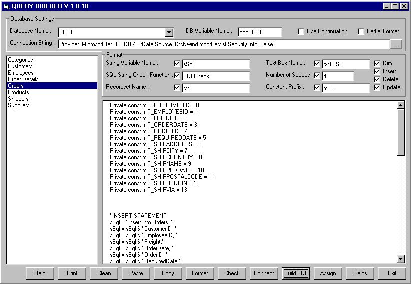



## SQL Query Builder

### Description

Everyone knows how time consuming and painful could be query code writing. This application is the MUST for all Database programmers who want to make their life a bit easier. The application allows generate and format chunks of code ready to be used in your application directly from Database.

Start the Application and press Help button for further instructions.
 
### More Info
 

             |
---                |---
**Submitted On**   |2001-05-31 10:48:02
**By**             |[Andy Shell](https://github.com/Planet-Source-Code/PSCIndex/blob/master/ByAuthor/andy-shell.md)
**Level**          |Intermediate
**User Rating**    |4.5 (45 globes from 10 users)
**Compatibility**  |VB 4\.0 \(32\-bit\), VB 5\.0, VB 6\.0
**Category**       |[Databases/ Data Access/ DAO/ ADO](https://github.com/Planet-Source-Code/PSCIndex/blob/master/ByCategory/databases-data-access-dao-ado__1-6.md)
**World**          |[Visual Basic](https://github.com/Planet-Source-Code/PSCIndex/blob/master/ByWorld/visual-basic.md)
**Archive File**   |[SQL Query 20519632001\.zip](https://github.com/Planet-Source-Code/andy-shell-sql-query-builder__1-23742/archive/master.zip)

